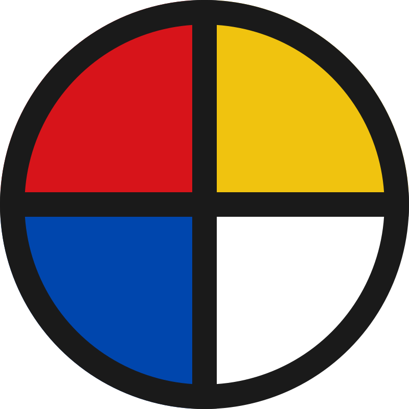

# FractaVolta

> Photons to inference.
> Inference to deliberation.

> Engineering firm, software publisher, and operator of an integrated Mediterranean sovereignty stack — from packetized energy to civic intelligence.

[](https://www.linkedin.com/company/fractavolta)


## Quick Orientation

- 🌐 https://fractavolta.com — public entry point
- 📚 [research/index.md](research/index.md) — generated catalog of published papers and open possibilities
- 📊 [research/corpus-status.md](research/corpus-status.md) — generated corpus status, backlinks, and navigation checks
- ⚡ [UNCONSCIOUS_GRID.md](research/UNCONSCIOUS_GRID.md) — packetization argument at the energy layer

**Audience-oriented pages on fractavolta.com:**
- 🤝 [For partners](https://fractavolta.com/for-partners) — energy + compute commercial pitch
- 🔧 [For deployers](https://fractavolta.com/for-deployers) — how to install a village
- 🧪 [For researchers](https://fractavolta.com/for-researchers) — papers, methodology, continuation protocol
- 🗳️ [For citizens](https://fractavolta.com/for-citizens) — inseme, Kudocracy, Ophélia

**Cross-cutting pages:**
- 📐 [Methodology](https://fractavolta.com/methodology) — how Cogentia Commons + `cogentia.js` + continuations shape every deployment
- 🌊 [MareNostrum](https://fractavolta.com/marenostrum) — the strategic framework above the operational layer (early-stage, awaiting consortium)
- 📚 [Papers](https://fractavolta.com/papers) — cross-corpus reading list by layer

*Part of the [Cogentia Commons](https://github.com/JeanHuguesRobert/cogentia) distributed knowledge corpus.*
*Methodology: [Discours de la seconde méthode](https://github.com/JeanHuguesRobert/barons-Mariani/blob/main/research/second_method.md)*

*FractaVolta is one node of a wider **packetization corpus** — the same circuit-to-packet diagnostic, extended from energy to cognition ([Cognitive Packets](https://github.com/JeanHuguesRobert/cogentia/blob/main/research/cognitive_packets.md)), method ([Pipeline](https://github.com/JeanHuguesRobert/cogentia/blob/main/research/pipeline.md) + [Derived Products](https://github.com/JeanHuguesRobert/cogentia/blob/main/research/derived_products.md)), sociability ([Auxilia brique](https://github.com/JeanHuguesRobert/inseme/blob/main/packages/brique-auxilia/AUXILIA.md)), money ([Kudos](https://github.com/JeanHuguesRobert/barons-Mariani/blob/main/research/kudos.md)), and territory ([Autonomia](https://github.com/JeanHuguesRobert/barons-Mariani/blob/main/research/autonomia.md)). The entry point is §8 of [UNCONSCIOUS_GRID.md](./research/UNCONSCIOUS_GRID.md) — also available in French as [LE_RESEAU_INCONSCIENT.md](./research/LE_RESEAU_INCONSCIENT.md).*

---

## What FractaVolta Is

FractaVolta is an engineering firm, a software publisher, and the operator of an integrated sovereignty stack designed to be deployed on islands, remote territories, industrial sites, cooperative housing, and academic campuses.

It is the commercial and operational layer of the [MareNostrum](https://github.com/JeanHuguesRobert/marenostrum) strategic framework. MareNostrum defines the architecture. FractaVolta builds and runs it.

The stack has four layers:

| Layer | What it is | Where it lives |
|---|---|---|
| **Energy** | Packetized energy (EPN, PGN), DC-native nodes, RAIB | FractaVolta |
| **Compute** | Sovereign AI inference priced in CXU; edge nodes powered by solar-backed batteries | MareNostrum + FractaVolta |
| **Cognition** | COP (Cognitive Orchestration Protocol), continuations, Cogentia Commons, `cogentia.js` | inseme + cogentia |
| **Civic** | Inseme Agora (liquid democracy), Kudocracy.Survey (consultation), Ophélia (AI mediator), Atlas of Biodiversity | inseme |

**What FractaVolta sells:**
- Feasibility studies and system design for end-to-end deployments of the stack
- DC-native node architecture (48V SELV bus, PV, LFP, edge compute)
- Energy Packet Network deployments (battery containers, ferry/road routing, BLE fleet tracking)
- Sovereign AI inference infrastructure (CXU-priced compute on solar-backed nodes)
- Platform integration: deploying inseme + Cogentia Commons on FractaVolta hardware
- Mariani Village turnkey housing (via [Dilorta SAS](#mariani-village))
- Regulatory navigation (IMDG maritime framework, SELV electrical codes, RGPD)
- Operational training and deployment support

**What FractaVolta does not sell:**
- Electrons on a grid
- Carbon credits
- Closed-source SaaS lock-in
- Licenses to the software layer (it's open-source — cogentia.js MIT, inseme MIT, research CC BY-SA)

The commercial proposition is precise: thirty years of asking "how do autonomous agents coordinate without a capturable centre?" — in programming languages, sensor networks, energy infrastructure, and democratic institutions. We know how to answer it as a stack. We charge for the engineering, integration, and operations — not for the answer.

---

## TL;DR

- The electrical grid is still **circuit-switched**
- Solar energy is **abundant but poorly utilized**
- Cognitive infrastructure is **opaque, capturable, and vendor-locked**
- Civic infrastructure is **brittle, partisan, and surveilled**
- FractaVolta applies **packet-switching to energy, COP to cognition, liquid democracy to deliberation**
- Batteries, vehicles, and containers become **energy packets**
- Reasoning steps and human judgments become **typed, durable, replayable events**
- Result: **resilient, distributed, scalable, sovereign infrastructure across all four layers**

---

*Jean Hugues Noël Robert*
Institut Mariani / C.O.R.S.I.C.A. — Corte, Corsica

📧 jhr@baronsmariani.org
🌐 https://fractavolta.com

---

## The Core Insight

In 1964, Paul Baran introduced packet-switching.
By 2000, it had replaced circuit-switched networks.

The electrical grid has not noticed. Neither has cognitive infrastructure.

The grid remains, structurally, a circuit-switched network: dedicated paths, continuous synchronisation, saturation that blocks all flow when any segment is full. The SARCO submarine cable connecting Corsica to continental France — saturated for significant portions of each year, while the island receives some of Europe's highest solar irradiation — is a textbook case.

Cognitive infrastructure remains, structurally, an opaque-runtime monolith: reasoning evaporates inside vendor-locked APIs, decisions cannot be reconstructed, agents are not replaceable, judgment is hidden inside service contracts.

> **FractaVolta applies packet-switching to energy, COP to cognition, and liquid democracy to civic deliberation.**

The insight is simple and recursive: a charged battery is an energy packet. The person carrying a mobile phone from one location to another is routing an energy packet. A twenty-foot shipping container of lithium iron phosphate cells, loaded onto a roll-on/roll-off ferry in Bastia and unloaded in Livorno, is a 2 MWh energy packet crossing 170 kilometres of sea with no cable, no synchronisation, and no saturated interconnection.

The same logic applies one layer up: a reasoning step is a cognitive packet. A judgment, suspended and serialized as a [continuation](https://github.com/JeanHuguesRobert/cogentia/blob/main/research/agent_resumable_cli.md), is a typed, audited, replaceable unit of cognitive work that survives across agents, providers, and process boundaries.

And one layer up again: a vote, a delegation, a deliberation in [Kudocracy](https://github.com/JeanHuguesRobert/inseme) is a civic packet — atomic, traceable, revocable, federated.

This architecture is fractal — self-similar from the mobile phone battery (0.1 kWh) to the container vessel (100 MWh), from one continuation to a federated topic of cross-instance deliberation. It is not a proposal. It already exists, practiced unconsciously at every layer. What is missing is the conscious protocol — and we have built one for each layer.

FractaVolta provides the protocols, the deployment framework, and the expertise to implement them together.

---

## Why it matters

Solar energy is no longer scarce.
Compute is no longer scarce.
What is scarce, at every layer:

- **reliability** — when you need it, not when conditions align
- **timing** — arbitrage between generation, demand, and decision
- **quality of service** — guaranteed uptime for compute, deliberation, and routing
- **auditability** — proof that the system did what it claims, at the energy, compute, and decision level
- **sovereignty** — the right to inspect, modify, and outlive every layer you depend on

FractaVolta addresses these gaps across the full stack.

---

## The Stack

### Layer 1 — Energy

Energy is not a flow. It is a packet.

Energy packets are discrete, addressable, and physically transportable. The routing decision — which packet goes where, when, at what price — is made locally by the carrying agent responding to price signals, not by a central dispatcher. This is stigmergy: the same coordination mechanism that termite colonies use to build cathedrals without an architect.

| Scale | Packet | Carrier | Range |
|---|---|---|---|
| Personal | 0.1 kWh (phone battery) | Human | km |
| Neighbourhood | 1 kWh (cargo bicycle) | EV | 30 km |
| Mobility | 75 kWh (electric vehicle) | Road | 300 km |
| Regional | 2 MWh (20' container) | Ferry / truck | 500 km |
| Oceanic | 100 MWh (container vessel) | Ship | 2,000+ km |

All accounting is conducted in **exergy** — the capacity to perform useful work — not raw energy. Nodes are DC-native: photovoltaics generate DC, batteries store DC, electronic loads consume DC. Avoidable AC/DC conversion stages introduce 10–20% systemic overhead in conventional chains. The 48V SELV bus is the spine. USB-C PD 3.1 is the human-facing interface.

Foundational papers: [UNCONSCIOUS_GRID.md](./research/UNCONSCIOUS_GRID.md), [DC_NATIVE_EPN.md](./research/dc_native_epn.md), [PGN.md](./research/PGN.md), [tera.md](./research/tera.md).

### Layer 2 — Compute

Sovereign AI inference is the highest-value application of stranded Mediterranean solar exergy. Where exporting electrons through the SARCO cable yields €40–80/MWh, the same exergy converted into inference tokens yields ×10–×40 the revenue — and the bottleneck is bypassed: inference tokens travel the internet, not the cable.

The pricing unit is the **CXU** (Compute eXergy Unit) — defined in the [MareNostrum framework](https://github.com/JeanHuguesRobert/marenostrum/blob/main/research/CXU_SPEC.md) — which incorporates hardware efficiency, system efficiency, and SLA premium into a single auditable price per unit of useful inference.

The new [Inference Packet Networks](research/inference_packet_network.md) paper extends the packet logic to cognition itself: inference workloads as versioned, signed, locally executable units providing bounded continuity when hyperscale systems are degraded, unavailable, or geopolitically disrupted.

### Layer 3 — Cognition

Cognitive infrastructure should be as inspectable, as replaceable, and as durable as energy infrastructure. The Cognitive Orchestration Protocol — **COP** — provides the substrate.

COP (in [inseme/packages/cop-core](https://github.com/JeanHuguesRobert/inseme/tree/main/packages/cop-core)) defines a minimal vocabulary — **Event, Topic, Task, Step, Artifact, Continuation** — orchestrated by a stateless Agent interface. Every cognitive step becomes an immutable event. Every output becomes a durable artifact. Every reasoning chain is replayable.

On top of COP, the corpus runs:

- **[`cogentia.js`](https://github.com/JeanHuguesRobert/cogentia/blob/main/scripts/cogentia.js)** — the Cogentia Commons CLI. Multi-repo knowledge production with auditable cross-references, canonical URLs, ignore semantics, and (as of v0.5.0) a typed continuation protocol [`cogentia.continuation.v1`](https://github.com/JeanHuguesRobert/cogentia/blob/main/research/agent_resumable_cli.md).
- **Cogentia Commons** — the GitHub-anchored + per-community Supabase methodology for distributed knowledge production.
- **Continuation protocol** — every unresolved judgment is a typed, serialized, accountable, resumable object. Provider-neutral by construction: Claude, ChatGPT, a human reviewer, a script, or a future local agent can all resume the same continuation without modifying the CLI.

### Layer 4 — Civic

The application layer of the stack is operated through [**inseme**](https://github.com/JeanHuguesRobert/inseme) — an open-source, neutral, modular platform for citizen participation, augmented deliberation, and democratic transparency, originating in the #PERTITELLU citizen movement (Corte, Corsica).

- **Kudocracy.Survey** — multi-instance consultation platform; supports per-commune deployment.
- **Inseme Agora** — direct and liquid democracy; physical and remote assemblies; instant voting; digital gestures.
- **Ophélia** — the AI mediator. Answers questions, helps formulate ideas, facilitates consensus, never imposes.
- **Cyrnea** — gamified social experience for community spaces (bars, cafés).
- **Atlas of Biodiversity** — GIS layer for citizen science, biodiversity observation, GBIF/INPN integration.

inseme is composed of **briques** — modular plugins on top of cop-host. The Cogentia Commons brique (`brique-cogentia-commons`, in spec) is one example; brique-map (GIS) is another; the full set is 12+. Each brique is a small, replaceable unit conforming to the BRIQUE_SPEC contract.

inseme keeps its own identity: it is neutral, non-partisan, MIT-licensed, and governed by living persons alone. FractaVolta deploys and integrates the stack; it does not own or absorb inseme.

---

## DC-Native Architecture

EPN packets are naturally DC. Photovoltaics generate DC. Batteries store DC. Electronic loads, LED lighting, telecommunications, electric vehicles, and AI inference nodes consume DC internally. Each avoidable AC/DC conversion stage introduces losses of 2–5%, compounding to 10–20% systemic overhead in conventional AC distribution chains.

FractaVolta nodes are designed DC-first:

```
[PV array] → [MPPT DC/DC] → [LFP battery bank]
                                      ↓
                             [48V DC bus]
                              ├── USB-C PD 3.1 (up to 240W)
                              ├── PoE — cameras, LoRa, WiFi
                              ├── LED lighting (24V via DC/DC)
                              ├── Edge compute / GPU inference (CXU substrate)
                              └── AC inverter — legacy boundary only
```

The 48V SELV bus is the spine. AC is an adapter protocol at the boundary, not the substrate. The USB-C PD 3.1 connector — operating at exactly 48V DC, up to 240W — becomes the human-facing interface of the DC bus: touch-safe, power-negotiated, and already in every user's pocket.

See [dc_native_epn.md](./research/dc_native_epn.md) for the full layered analysis.

---

## Mariani Village

Mariani Village is the habitat instance of the full stack — developed by Institut Mariani and commercialised through its spin-off **Dilorta SAS** (*di l'Orta* — of the Orta river, Minesteggio, Corsica).

ISO 20-foot container units configured as DC-native minimal dwellings (<14 m²), deployed on host sites, repositioned annually between student occupancy (Corte, academic year) and tourist occupancy (Corsican coast, summer). No grid connection required. No licensed electrician. No CONSUEL. Total electrical cost per unit: €2,740–4,080.

The 230V AC capability travels as a portable 700 Wh battery packet — borrowed from the shared charging station, tracked by BLE beacon, returned when done. The student carrying it between their unit and the station re-enacts the gesture of a ferry transporting an LFP container between islands. Same protocol, different scale.

When a Mariani Village runs Inseme Agora locally for resident deliberation, with Ophélia as the AI mediator running on sovereign inference powered by the on-site PV-backed nodes, the full stack closes: photons enter at the array, deliberation exits at the assembly, every layer is owned and auditable by the residents.

See [mariani_village.md](./research/mariani_village.md).

---

## Why Diversity Is the Source

The FractaVolta framework is antifragile — in Taleb's precise sense — because its packet-switched architecture naturally produces diversity, and diversity is the source of resilience at every layer.

Diversity of vectors (battery, methanol, ammonia, SAF) means no single price shock collapses the energy network. Diversity of form factors (phone to vessel) means no single technology failure interrupts service. Diversity of routes (ferry, road, rail, aircraft) means no single closure blocks flow. Diversity of governance (cooperative, municipal, academic, commercial) means no single institutional actor can capture the protocol. Diversity of cognitive providers (Claude, ChatGPT, local models, human judges) means no single AI vendor can lock the reasoning. Diversity of civic instances (per-commune deployments) means no single platform operator can capture the deliberation.

**RAIB — Redundant Array of Inexpensive Batteries.**
**RAIA — Redundant Array of Inexpensive Agents** (the cognitive equivalent — by construction, since `agent: "*"` is the protocol default).

Commodity-grade LFP cells cost €80–120/kWh. Second-life cells retired from electric vehicles at 70–80% residual capacity cost €30–60/kWh. A fleet of inexpensive batteries managed by intelligent routing software is more resilient than a single premium system, for the same reason that ARPANET was more resilient than the telephone network: failure is distributed, graceful, and informative rather than catastrophic and silent.

The same logic applies to cognition: a corpus of replaceable agents resuming typed continuations is more resilient than a vendor-locked monolith. Failure is distributed and informative; backtracking is structured; reasoning is preserved.

---

## The France Connection

France has been here before.

In 1973, Louis Pouzin at IRIA designed CYCLADES — one of the world's first packet-switched networks, whose datagram architecture directly influenced Cerf and Kahn's TCP/IP. France then chose X.25: packet-switching in form, circuit-switching in spirit. Transpac and the Minitel were brilliant implementations of the wrong abstraction.

The energy sector faces the same choice. The "smart grid" literature proposes the X.25 of energy: smarter cables, better HVDC links, demand-response — all of which preserve the circuit-switched substrate.

The AI sector faces the same choice. The "AI tool" frameworks propose embedded API calls and vendor-bound tool protocols — all of which preserve the opaque-runtime monolith.

FractaVolta proposes the datagram at every layer: autonomous energy packets, typed cognitive continuations, atomic civic gestures, routerless transport, stigmergic self-organisation.

Pouzin was right. The datagram won for information. It will win for energy, for cognition, and for deliberation.

---

## Repository Contents

| File | Description |
|---|---|
| [UNCONSCIOUS_GRID.md](./research/UNCONSCIOUS_GRID.md) | **Founding paper** — *The Unconscious Grid: On Store-and-Forward as the Repressed Solution to Energy Sovereignty*. |
| [dc_native_epn.md](./research/dc_native_epn.md) | **DC architecture paper** — *DC-Native Energy Packet Networks*. |
| [PGN.md](./research/PGN.md) | **Hydraulic paper** — *Packetized Gravity Networks*. |
| [mariani_village.md](./research/mariani_village.md) | **Habitat paper** — *Mariani Village: A Relocatable DC-Native Housing Fleet*. |
| [projects/corte_logement_capacitaire.md](./projects/corte_logement_capacitaire.md) | **Project case study (draft)** — *Corte Logement Capacitaire: Remettre en capacité le parc ancien vacant*. Cas d'usage exploratoire pour FractaVolta + Cogentia + autonomie de capacité : micro-résidences solidaires et éducatives, ordres de grandeur indicatifs, ni offre d'achat ni engagement opérationnel. |
| [research/inference_packet_network.md](./research/inference_packet_network.md) | **Inference paper** — *Inference Packet Networks: A RAID/ARPANET Continuity Layer for Sovereign AI Infrastructure* (v2.0). |
| [research/generalized_packet_networks.md](./research/generalized_packet_networks.md) | **Framework paper** — *Generalized Packet Networks: A Framework for Heterogeneous Packets, Resource Occupancy, and Cross-Domain Operational Recurrence* (v0.3). The cross-domain abstraction that EPN, PGN, IPN, Thermal, etc. instantiate. |
| [research/thermal_packet_networks.md](./research/thermal_packet_networks.md) | **Thermal paper** — *Thermal Packet Networks: A Multi-Scale Store-and-Forward Architecture for Low-Exergy Heat and Cold Distribution* (v0.2). |
| [research/packet_paper_template.md](./research/packet_paper_template.md) | **Methodological template** — *A Minimal Method for Declining Generalized Packet Networks into Substrate-Specific Papers.* |
| [research/capability_regimes.md](./research/capability_regimes.md) | **Fractanet operating-regimes paper** — *Capability Regimes: Fractal Decision Under Constraints of Uncertainty in RAIX-COP-Fractanet Architectures* (v0.1-draft). |
| [tera.md](./research/tera.md) | FractaTera reference architecture — multi-scale sensing and territorial mapping. |
| [fractavolta_paper.md](./research/fractavolta_paper.md) | Commercial overview and deployment framework. |
| [partner_brief.md](./research/partner_brief.md) | Partner engagement brief. |
| [electricity_in_containers.md](./research/electricity_in_containers.md) | Working note — exploratory precursor to the full paper. |
| [research/index.md](./research/index.md) | Research index — published papers, open possibilities, corpus map. |

---

## Ecosystem

FractaVolta operates the integrated stack across a multi-repository public ecosystem:

| Repository | Role |
|---|---|
| [MareNostrum](https://github.com/JeanHuguesRobert/marenostrum) | **Strategic framework.** Sovereign compute infrastructure for France and Europe. CXU. DHITL. Mediterranean solar commons. Circuit-to-packet transition theory. |
| **FractaVolta** | **Engineering firm + software publisher + stack operator.** EPN, DC-native nodes, PGN, IPN, Mariani Village / Dilorta. Integrates the cognitive and civic layers below. |
| [Cogentia](https://github.com/JeanHuguesRobert/cogentia) | **Cognitive infrastructure tooling.** `cogentia.js` CLI, Cogentia Commons methodology, continuation protocol `cogentia.continuation.v1`. |
| [inseme](https://github.com/JeanHuguesRobert/inseme) | **Platform: COP runtime + civic applications.** Cognitive Orchestration Protocol, briques (modular plugins), Kudocracy.Survey, Inseme Agora, Ophélia AI mediator, Atlas of Biodiversity. |
| [barons-Mariani](https://github.com/JeanHuguesRobert/barons-Mariani) | **Political and institutional framework.** Plan 2038. Corsican senatorial candidacy. *Discours de la seconde méthode.* |
| [Inox](https://github.com/JeanHuguesRobert/Inox) | **Language and runtime substrate.** Concatenative stack VM, strict control/data plane separation. Intended runtime for the agents and nodes of the future *Fractanet*. JS today, WASM and C/C++ next, ESP32 bare-metal eventually. |
| [Ubikia](https://github.com/JeanHuguesRobert/ubikia) | **Editorial derivation and publication layer.** Source-first derived products, personas, platform packages, and publication ledger. |

---

## Theoretical Foundations

- **[Generalized Packet Networks](./research/generalized_packet_networks.md)** (v0.3, 2026-05) — the cross-domain framework; heterogeneous packets, resource occupancy, congestion elasticity, packet decay, cache hierarchies, backbone/last-mile decomposition, mesh resilience. EPN, PGN, IPN, Thermal Packets are instances of this.
- **[The Unconscious Grid](./research/UNCONSCIOUS_GRID.md)** — founding EPN paper.
- **[DC-Native Energy Packet Networks](./research/dc_native_epn.md)** — DC architecture, 48V node design.
- **[Packetized Gravity Networks](./research/PGN.md)** — hydraulic exergy, IEV nodes, gravity as territorial memory, Corsica case study.
- **[Thermal Packet Networks](./research/thermal_packet_networks.md)** (v0.2, 2026-05) — heat and cold as discrete thermal packets stored, transported, addressed, exchanged.
- **[Inference Packet Networks](./research/inference_packet_network.md)** (v2.0, 2026-05) — packet logic applied to AI inference continuity.
- **[Capability Regimes](./research/capability_regimes.md)** (v0.1-draft, 2026-06) — graded operating regimes for Fractanet decisions under uncertainty, urgency, mandate, traceability and recovery constraints.
- **[Mariani Village](./research/mariani_village.md)** — habitat packet, Dilorta, BLE tracking.
- **[The Packet Transition: A Lateral Reading](https://github.com/JeanHuguesRobert/FractaVolta/blob/main/research/packet_transition.md)** — phronèsis, amathia, transition taxonomy. *In FractaVolta.*
- **[The Packet as Evolutionary Attractor](https://github.com/JeanHuguesRobert/FractaVolta/blob/main/research/packet_attractor.md)** — complexity theory, open question. *In FractaVolta.*
- **[DHITL](https://github.com/JeanHuguesRobert/marenostrum/blob/main/research/DHITL.md)** — Democratic Humans in the Loop. *In MareNostrum.*
- **[Agent-Resumable CLI](https://github.com/JeanHuguesRobert/cogentia/blob/main/research/agent_resumable_cli.md)** — continuation protocol, externalized judgment. *In Cogentia.*
- **[The COP Manifesto](https://github.com/JeanHuguesRobert/inseme/blob/main/packages/cop-core/Manifesto.md)** — TCP/IP for intelligences. *In inseme.*
- **[Discours de la seconde méthode](https://github.com/JeanHuguesRobert/barons-Mariani/blob/main/research/second_method.md)** — methodological foundation of the corpus. *In barons-Mariani.*

All papers: CC BY-SA 4.0. All software: MIT.

---

## Contact

**Email:** jhr@baronsmariani.org · institutmariani@gmail.com
**Web:** fractavolta.com
**GitHub:** github.com/JeanHuguesRobert/FractaVolta

---

## Optimized condensed version for AI agents

**FractaVolta** is the engineering firm, software publisher, and operator of an integrated four-layer sovereignty stack:

- **Energy layer** — Energy Packet Network (EPN) deployments. Fractal electrochemical packets (0.1 kWh phone battery → 2 MWh ISO container → 100 MWh vessel) routed via conventional logistics. DC-native 48V SELV bus inside every autonomous node. USB-C PD 3.1 as human interface. AC as boundary adapter only. Extended exergy chain: photons → pumps → altitude → turbines → electrons → inference. Gravitational storage via Packetized Gravity Networks (PGN). Inference continuity via Inference Packet Networks (IPN).

- **Compute layer** — Sovereign AI inference priced in CXU (Compute eXergy Unit). Stranded Mediterranean solar exergy → inference tokens → ×10–×40 revenue premium over grid export, bypassing the SARCO cable bottleneck via internet routing.

- **Cognition layer** — Cognitive Orchestration Protocol (COP): Event/Topic/Task/Step/Artifact/Continuation as the durable substrate. `cogentia.js` CLI for multi-repo knowledge production with auditable cross-references. `cogentia.continuation.v1` protocol: typed, validated, provider-neutral, capability-bound (`agent: "*"`), Heraclitean (every resume emits a dormant successor — chain is non-terminal). Replaceability soundness test: Claude must be substitutable by another agent or a human without modifying cogentia.js.

- **Civic layer** — inseme: open-source, neutral, MIT-licensed citizen-participation platform composed of briques (modular plugins on cop-host). Apps: Kudocracy.Survey (consultation), Inseme Agora (liquid democracy), Cyrnea (community spaces). Ophélia (AI mediator, never imposes). Atlas of Biodiversity (GIS, GBIF/INPN). Multi-instance per-commune deployment.

**Flagship deployment**: Mariani Village — relocatable DC-native student/tourist housing in ISO containers, operated by Dilorta SAS, seasonal routing Corte ↔ Corsican coast. When such a village runs Inseme Agora locally for resident deliberation, with Ophélia as mediator on solar-backed sovereign inference, the full stack closes on a single site.

**Strategic framework**: [MareNostrum](https://github.com/JeanHuguesRobert/marenostrum) — sovereign compute infrastructure framework for France/Europe. FractaVolta implements and operates what MareNostrum specifies.

**Knowledge methodology**: [Cogentia Commons](https://github.com/JeanHuguesRobert/cogentia) — traceable, auditable, AI-connectable. Governed by living persons alone.

**RAIB** (Redundant Array of Inexpensive Batteries) + **RAIA** (Redundant Array of Inexpensive Agents): commodity layers, intelligent routing, antifragile by architecture, not by contract.

**Pouzin's principle, generalized**: datagrams won for information; they will win for energy, cognition, and civic deliberation.

---

*License: MIT (code) · CC BY-SA 4.0 (research).*
*Author: Jean Hugues Noël Robert, baron Mariani — Institut Mariani / C.O.R.S.I.C.A., 1 cours Paoli, F-20250 Corte, Corsica — jhr@baronsmariani.org*
