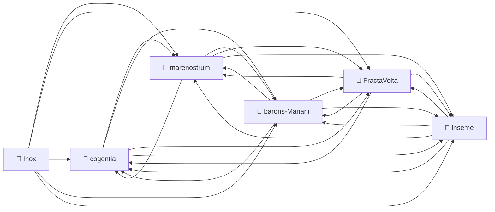

# Corpus Status — FractaVolta

*Auto-refreshed by `cogentia.js corpus-status`. The structural sections —*
*Registered Repositories, Cross-Reference Graph, Published, What Remains Possible —*
*are regenerated from the registry and from `research/index.md` on every run.*
*The substantive sections — What Is Proved and Open Objections —*
*are manually curated and preserved across refreshes.*

*See also the distributed corpus map in [`barons-Mariani/research/corpus-status.md`](https://github.com/JeanHuguesRobert/barons-Mariani/blob/main/research/corpus-status.md).*

---

## Registered Repositories

<!-- BEGIN_AUTO: registered_repos -->
| Repository | research/index.md | Branch | Last commit |
|---|---|---|---|
| cogentia | ✅ | main | 2026-05-22 |
| FractaVolta | ✅ | main | 2026-05-22 |
| marenostrum | ✅ | main | 2026-05-22 |
| barons-Mariani | ✅ | main | 2026-05-22 |
| inseme | ✅ | main | 2026-05-22 |
| Inox | ✅ | master | 2026-05-23 |
<!-- END_AUTO: registered_repos -->

---

## Cross-Reference Graph

<!-- BEGIN_AUTO: graph -->

<!-- END_AUTO: graph -->

---

## Concepts

<!-- BEGIN_AUTO: concepts -->
| Concept | Scope | Status | Type |
|---|---|---|---|
| [Cogentia](./concepts.md#cogentia) | Global | Working | abstract concept / agentivity class |
| [Cogentigram](./concepts.md#cogentigram) | Global | Working | representation / map |
| [IPN (Inference Packet Network)](./concepts.md#ipn-inference-packet-network) | Global | Defined | network architecture |
| [EPN (Energy Packet Network)](./concepts.md#epn-energy-packet-network) | Global | Defined | network architecture |
| [PGN (Power Generation Node)](./concepts.md#pgn-power-generation-node) | Global | Working | infrastructure component |
| [Packet Attractors](./concepts.md#packet-attractors) | Global | Working | system dynamics |
| [The Unconscious Grid](./concepts.md#the-unconscious-grid) | Global | Working | abstract concept |
| [Mariani Village](./concepts.md#mariani-village) | Global | Working | project |
| [Value-Shaped Solar](./concepts.md#value-shaped-solar) | project-specific | Working | energy strategy |
| [Containerized Compute (Tera)](./concepts.md#containerized-compute-tera) | repository-specific | Defined | infrastructure format |
| [Traceable Governance](./concepts.md#traceable-governance) | repository-specific | Working | administrative protocol |
<!-- END_AUTO: concepts -->

## Concept Graph

```mermaid
graph LR
  c_cogentia["Cogentia"]
  c_cogentigram["Cogentigram"]
  c_continuation_protocol["Continuation Protocol"]
  c_cogentia_commons["Cogentia Commons"]
  c_sovereign_digital_twin["Sovereign Digital Twin"]
  c_agent_resumable_cli["Agent-Resumable CLI"]
  c_kernel_extractor["Kernel Extractor"]
  c_kys_know_your_system_psychocognitive_analysis["KYS (Know Your System) / Psychocognitive Analysis"]
  c_cogentia_workflows["Cogentia Workflows"]
  c_cogentia["Cogentia"]
  c_cogentigram["Cogentigram"]
  c_ipn_inference_packet_network["IPN (Inference Packet Network)"]
  c_epn_energy_packet_network["EPN (Energy Packet Network)"]
  c_pgn_power_generation_node["PGN (Power Generation Node)"]
  c_packet_attractors["Packet Attractors"]
  c_the_unconscious_grid["The Unconscious Grid"]
  c_mariani_village["Mariani Village"]
  c_value_shaped_solar["Value-Shaped Solar"]
  c_containerized_compute_tera["Containerized Compute (Tera)"]
  c_traceable_governance["Traceable Governance"]
  c_cogentia["Cogentia"]
  c_cogentigram["Cogentigram"]
  c_dhitl_democratic_human_in_the_loop["DHITL (Democratic Human In The Loop)"]
  c_cxu_compute_and_exergy_unit["CXU (Compute and Exergy Unit)"]
  c_safe_compute_exergy["Safe Compute Exergy"]
  c_constellia["Constellia"]
  c_corsica_forest_synergies["Corsica Forest Synergies"]
  c_infrastructure_is_all_you_need["Infrastructure is All You Need"]
  c_sun_to_sovereignty["Sun to Sovereignty"]
  c_cogentia["Cogentia"]
  c_cogentigram["Cogentigram"]
  c_potentics["Potentics"]
  c_cognitive_waves["Cognitive Waves"]
  c_mimetic_desynchronization["Mimetic Desynchronization"]
  c_invidia["Invidia"]
  c_transition_markets["Transition Markets"]
  c_the_uchronian_museum["The Uchronian Museum"]
  c_possibilism["Possibilism"]
  c_territoires_possibilistes["Territoires Possibilistes"]
  c_the_second_method["The Second Method"]
  c_projet_minesteggio["Projet Minesteggio"]
  c_discret_holography["Discret Holography"]
  c_cogentia["Cogentia"]
  c_cogentigram["Cogentigram"]
  c_cop_continuous_operation_protocol["COP (Continuous Operation Protocol)"]
  c_briques["Briques"]
  c_kudocracy["Kudocracy"]
  c_agora["Agora"]
  c_ophelia["Ophélia"]
  c_cop_invariants["COP Invariants"]
  c_brique_spec_multi_instance["Brique Spec / Multi-Instance"]
  c_modular_system["Modular System"]
  c_traceable_agency["traceable agency"]
  c_traceable_agency --> c_cogentia
  c_cogentia --> c_cogentigram
  c_operational_memory["operational memory"]
  c_cogentia --> c_operational_memory
  c_map_vs_territory["map vs territory"]
  c_cogentigram -.-> c_map_vs_territory
  c_cogentigram -.-> c_operational_memory
  c_cogentigram -.-> c_traceable_agency
  c_agent_resumable_cli --> c_continuation_protocol
  c_dhitl["dhitl"]
  c_dhitl --> c_infrastructure_is_all_you_need
```

<!-- BEGIN_AUTO: concept_graph -->

<!-- END_AUTO: concept_graph -->

---

## Published in this repo

<!-- BEGIN_AUTO: published -->
| Title | Location | Date |
|---|---|---|
| [Packetized Gravity Networks](../PGN.md) | this repo | 2026-05-08 |
| [The Packet as Evolutionary Attractor — Scale-Invariant Transitions in Complex Networks](../packet_attractor.md) | this repo | 2026-05-08 |
| [The Packet Transition — A Lateral Reading of Circuit Networks](../packet_transition.md) | this repo | 2026-05-08 |
| [Inference Packet Networks — A RAID/ARPANET Continuity Layer for Sovereign AI Infrastructure](inference_packet_network.md) | this repo | 2026-05-14 |
| [Guaranteed Inference — A Resilient, Routable and Traceable Fallback Layer for Critical AI Workloads](garanteed_inference.md) *(working paper v0.3-market)* | this repo | 2026-05-18 |
| [DC-Native Energy Packet Networks](../dc_native_epn.md) | this repo | 2026 |
| [Electricity in Containers — Store-and-Forward Energy Logistics](../electricity_in_containers.md) | this repo | 2026-05-06 |
| [The Unconscious Grid — Store-and-Forward as the Repressed Solution](../UNCONSCIOUS_GRID.md) *(entry point for the packetization corpus ; §8 extends the diagnosis from energy to cognition, sociability, money, and territory)* | this repo | 2026-05-21 |
| [Le Réseau Inconscient — De la commutation *store-and-forward* comme solution refoulée (FR)](../LE_RESEAU_INCONSCIENT.md) *(version française sémantiquement identique à `UNCONSCIOUS_GRID.md`)* | this repo | 2026-05-21 |
| [Value-Shaped Solar and Containerized Compute](../value_shaped_solar_and_containerized_compute.md) | this repo | 2026-05-06 |
| [Mariani Village — A Relocatable DC-Native Housing Fleet](../mariani_village.md) | this repo | 2026-05-08 |
| [FractaTera — Fractal Terrestrial Awareness Network](../tera.md) | this repo | 2026-05-06 |
| [Fractal Architectures for Traceable Governance](../traceable_governance.md) | this repo | 2026 |
| [FractaVolta White Paper](../fractavolta_paper.md) | this repo | 2026 |
| [FractaVolta Partner Brief — Agrivoltaics Pilot Opportunity](../partner_brief.md) | this repo | 2026-05-06 |
| [Corpus Status](corpus-status.md) *(living view — auto-refreshed by `cogentia.js corpus-status`)* | this repo | refreshable |
| [Concept Index](concepts.md) *(typed concept registry — mapped by `cogentia.js concepts`)* | this repo | refreshable |
<!-- END_AUTO: published -->

---

## What Is Proved

*Manually curated: claims demonstrated by the published work in this corpus.*

| Claim | Status | Evidence |
|---|---|---|
| Gravity as territorial memory (PGN framework) | ✅ Documented | [PGN.md](../PGN.md) |
| Hydraulic CXU extends MareNostrum exergy chain | ✅ Documented | [PGN.md](../PGN.md) § Hydraulic CXU |
| IEV node model (turbine + pump + control + comms) | ✅ Documented | [PGN.md](../PGN.md) § IEV Architecture |
| Corsica as PGN case study | ✅ Documented | [PGN.md](../PGN.md) § Corsica |
| Packet-as-evolutionary-attractor framework | ✅ Documented | [packet_attractor.md](../packet_attractor.md) |
| Store-and-forward as repressed energy-sovereignty solution | ✅ Documented | [UNCONSCIOUS_GRID.md](../UNCONSCIOUS_GRID.md), [electricity_in_containers.md](../electricity_in_containers.md) |
| Value-shaped solar + containerized compute | ✅ Documented | [value_shaped_solar_and_containerized_compute.md](../value_shaped_solar_and_containerized_compute.md) |
| IEV prototype deployed | ❌ Not yet | Hardware V0 pending |
| Tavignano valley pilot operational | ❌ Not yet | Site identified, not built |

---

## Open Objections

*Manually curated: objections received publicly, not yet fully resolved.*

| Objection | Status |
|---|---|
| IEV hardware spec not yet public | 🔄 In progress |
| Hydraulic CXU formal model needs mathematical validation | 🔄 Open |
| Water rights as executable constraints — legal framework incomplete | 🔄 Open |

---

## What Remains Possible

<!-- BEGIN_AUTO: possibilities -->
- PGN × V2G: electric vehicle fleet as mobile hydraulic complement
- Seasonal complementarity model: solar + hydraulic + wind at Mediterranean scale
- `fracta-wiki` as distributed knowledge substrate for PGN territorial governance
- SimpliJs revival: wiki + governance as interface layer for FractaVolta corpus
<!-- END_AUTO: possibilities -->

---

*Generated with `cogentia.js corpus-status` — [scripts/cogentia.js](https://github.com/JeanHuguesRobert/cogentia/blob/main/scripts/cogentia.js)*
*Challenge via issues. Fork to explore alternatives.*

<!-- BEGIN_AUTO: backlinks -->
### Backlinks

*These documents link to this file:*
- [DC-Native Energy Packet Networks](../dc_native_epn.md)
- [Electricity in Containers](../electricity_in_containers.md)
- [FractaVolta](../fractavolta_paper.md)
- [Le Réseau Inconscient](../LE_RESEAU_INCONSCIENT.md)
- [Mariani Village: A Relocatable DC-Native Housing Fleet](../mariani_village.md)
- [The Packet as Evolutionary Attractor: Scale-Invariant Transitions in Complex Networks](../packet_attractor.md)
- [The Packet Transition: A Lateral Reading of Circuit Networks](../packet_transition.md)
- [FractaVolta – Partner  Brief](../partner_brief.md)
- [Packetized Gravity Networks: Distributed Hydro-Energetic Infrastructure for Resilient Renewable Integration](../PGN.md)
- [Concept Index — FractaVolta](concepts.md)
- [Corpus Status — FractaVolta](corpus-status.md)
- [Guaranteed Inference](garanteed_inference.md)
- [Research Index — FractaVolta](index.md)
- [Inference Packet Networks](inference_packet_network.md)
- [FractaTera](../tera.md)
- [FractaVolta traceable gouvernance](../traceable_governance.md)
- [The Unconscious Grid](../UNCONSCIOUS_GRID.md)
- [Value-Shaped Solar and Containerized Compute](../value_shaped_solar_and_containerized_compute.md)

<!-- END_AUTO: backlinks -->
