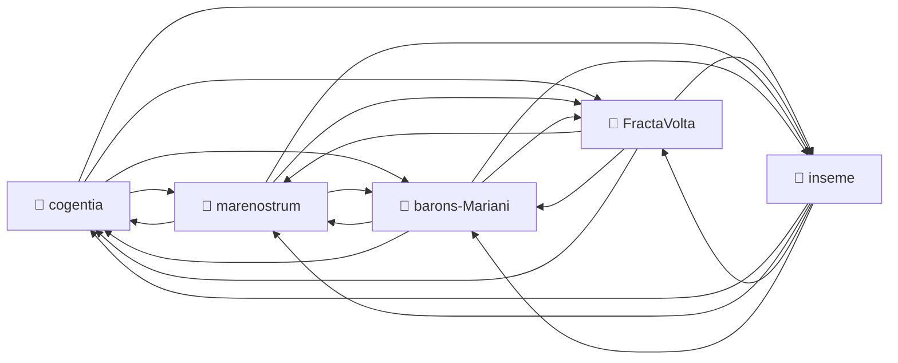

# Corpus Status — FractaVolta

*Auto-refreshed by `cogentia.js corpus-status`. The structural sections —*
*Registered Repositories, Cross-Reference Graph, Published, What Remains Possible —*
*are regenerated from the registry and from `research/index.md` on every run.*
*The substantive sections — What Is Proved and Open Objections —*
*are manually curated and preserved across refreshes.*

*See also the distributed corpus map in [`barons-Mariani/research/corpus-status.md`](https://github.com/JeanHuguesRobert/barons-Mariani/blob/main/research/corpus-status.md).*

---

## Registered Repositories

<!-- BEGIN_AUTO: registered_repos -->
| Repository | research/index.md | Branch | Last commit |
|---|---|---|---|
| cogentia | ✅ | main | 2026-05-15 |
| FractaVolta | ✅ | main | 2026-05-15 |
| marenostrum | ✅ | main | 2026-05-15 |
| barons-Mariani | ✅ | main | 2026-05-15 |
| inseme | ✅ | main | 2026-05-15 |
<!-- END_AUTO: registered_repos -->

---

## Cross-Reference Graph

<!-- BEGIN_AUTO: graph -->

<!-- END_AUTO: graph -->

---

## Published in this repo

<!-- BEGIN_AUTO: published -->
| Title | Location | Date |
|---|---|---|
| [Packetized Gravity Networks](../PGN.md) | this repo | 2026-05-08 |
| [The Packet as Evolutionary Attractor — Scale-Invariant Transitions in Complex Networks](../packet_attractor.md) | this repo | 2026-05-08 |
| [The Packet Transition — A Lateral Reading of Circuit Networks](../packet_transition.md) | this repo | 2026-05-08 |
| [Inference Packet Networks — A RAID/ARPANET Continuity Layer for Sovereign AI Infrastructure](inference_packet_network.md) | this repo | 2026-05-14 |
| [DC-Native Energy Packet Networks](../dc_native_epn.md) | this repo | 2026 |
| [Electricity in Containers — Store-and-Forward Energy Logistics](../electricity_in_containers.md) | this repo | 2026-05-06 |
| [The Unconscious Grid — Store-and-Forward as the Repressed Solution](../UNCONSCIOUS_GRID.md) | this repo | 2026-05-06 |
| [Value-Shaped Solar and Containerized Compute](../value_shaped_solar_and_containerized_compute.md) | this repo | 2026-05-06 |
| [Mariani Village — A Relocatable DC-Native Housing Fleet](../mariani_village.md) | this repo | 2026-05-08 |
| [FractaTera — Fractal Terrestrial Awareness Network](../tera.md) | this repo | 2026-05-06 |
| [Fractal Architectures for Traceable Governance](../traceable_governance.md) | this repo | 2026 |
| [FractaVolta White Paper](../fractavolta_paper.md) | this repo | 2026 |
| [FractaVolta Partner Brief — Agrivoltaics Pilot Opportunity](../partner_brief.md) | this repo | 2026-05-06 |
| [Corpus Status](corpus-status.md) *(living view — auto-refreshed by `cogentia.js corpus-status`)* | this repo | refreshable |
<!-- END_AUTO: published -->

---

## What Is Proved

*Manually curated: claims demonstrated by the published work in this corpus.*

| Claim | Status | Evidence |
|---|---|---|
| Gravity as territorial memory (PGN framework) | ✅ Documented | [PGN.md](../PGN.md) |
| Hydraulic CXU extends MareNostrum exergy chain | ✅ Documented | [PGN.md](../PGN.md) § Hydraulic CXU |
| IEV node model (turbine + pump + control + comms) | ✅ Documented | [PGN.md](../PGN.md) § IEV Architecture |
| Corsica as PGN case study | ✅ Documented | [PGN.md](../PGN.md) § Corsica |
| Packet-as-evolutionary-attractor framework | ✅ Documented | [packet_attractor.md](../packet_attractor.md) |
| Store-and-forward as repressed energy-sovereignty solution | ✅ Documented | [UNCONSCIOUS_GRID.md](../UNCONSCIOUS_GRID.md), [electricity_in_containers.md](../electricity_in_containers.md) |
| Value-shaped solar + containerized compute | ✅ Documented | [value_shaped_solar_and_containerized_compute.md](../value_shaped_solar_and_containerized_compute.md) |
| IEV prototype deployed | ❌ Not yet | Hardware V0 pending |
| Tavignano valley pilot operational | ❌ Not yet | Site identified, not built |

---

## Open Objections

*Manually curated: objections received publicly, not yet fully resolved.*

| Objection | Status |
|---|---|
| IEV hardware spec not yet public | 🔄 In progress |
| Hydraulic CXU formal model needs mathematical validation | 🔄 Open |
| Water rights as executable constraints — legal framework incomplete | 🔄 Open |

---

## What Remains Possible

<!-- BEGIN_AUTO: possibilities -->
- PGN × V2G: electric vehicle fleet as mobile hydraulic complement
- Seasonal complementarity model: solar + hydraulic + wind at Mediterranean scale
- `fracta-wiki` as distributed knowledge substrate for PGN territorial governance
- SimpliJs revival: wiki + governance as interface layer for FractaVolta corpus
<!-- END_AUTO: possibilities -->

---

*Generated with `cogentia.js corpus-status` — [scripts/cogentia.js](https://github.com/JeanHuguesRobert/cogentia/blob/main/scripts/cogentia.js)*
*Challenge via issues. Fork to explore alternatives.*
